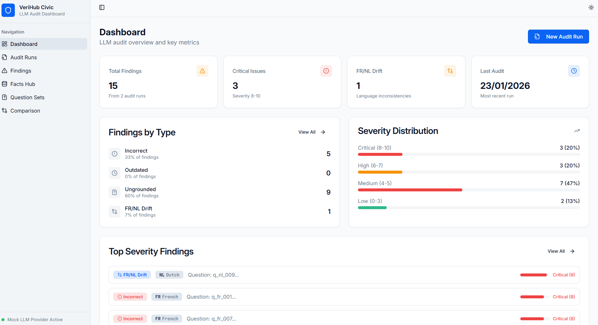

# VeriHub — LLM Audit & Drift Dashboard

VeriHub helps organisations monitor what public LLMs say about them (FR/NL/EN) so customers don’t get misled by wrong or outdated “first answers”.
We run recurring Q&A audits, flag high-risk issues (wrong/outdated answers, missing sources, FR/NL drift), guide fast fixes on official pages/FAQs, and recheck the before/after delta.

**Status:** pilot-ready prototype. **Public MVP launch:** March 2026.  
**Looking for:** 1–2 pilot partners in Belgium (FR/NL).

## Why this matters

LLM answers scale. A single outdated link, wrong phone number, missing deadline, or inconsistent FR/NL instruction can propagate across thousands of interactions and cause real-world harm: missed deadlines, incorrect submissions, extra helpdesk load, and loss of trust.

## 🚀 Why VeriHub?
In the AI-first world, your reputation isn't in search results; it's in LLM responses. 
- **EU AI Act Ready**: Helping regulated sectors (Finance, Insurance, Utilities) comply with accuracy requirements.
- **Multilingual Native**: Automated detection of FR/NL drift—the #1 pain point for Belgian enterprises.
- **Measurable ROI**: Move from "AI says wrong things" to a structured "Operating Loop" with measurable improvements.

## Features

- **Dashboard**: Overview with metrics, finding counts by type/severity/language
- **Facts Hub**: CRUD operations for verified facts with FR/NL pairs
- **Question Sets**: Pre-defined question sets for auditing LLM responses
- **Audit Runs**: Execute audits with different LLM providers (mock-baseline, mock-after, openai)
- **Findings Detection**: Automatic detection of incorrect, outdated, ungrounded, and drift issues
- **Before/After Comparison**: Compare two audit runs to see improvements

## 🛠 Tech & Trust
Built with a production-grade stack (React, Express, PostgreSQL, MCP) and ready for enterprise pilots.

## Screenshots

### Dashboard — key metrics and severity overview


The dashboard summarizes the most recent audit results: total findings across runs, critical issues (severity 8–10), FR/NL drift count, and a severity distribution breakdown.

### Findings — actionable issue list with suggested fixes


The findings page provides a filterable list of detected issues (incorrect, outdated, ungrounded, FR/NL drift). Each item includes evidence (expected vs actual) and a suggested fix to reduce real-world harm (wrong fees, outdated links, inconsistent procedures across languages).

---

## Quick Start

### Local Development

```bash
# Install dependencies
npm install

# Run development server
npm run dev
```

The application will be available at http://localhost:5000

### Running Tests

```bash
# Run all backend tests
npx vitest run

# Run unit tests only
npx vitest run server/tests/unit

# Run integration tests only
npx vitest run server/tests/integration

# Run frontend tests
npx vitest run --config vitest.config.frontend.ts

# Watch mode
npx vitest
```

### Docker Deployment

```bash
# Build and run with docker-compose
docker compose up --build

# Access the application at http://localhost
```

## Project Structure

```
├── client/                 # Frontend React application
│   ├── public/data/sources # Verified markdown sources
│   └── src/
│       ├── components/     # Reusable UI components
│       ├── pages/          # Page components
│       └── lib/            # Utilities and types
├── server/                 # Backend Express application
│   ├── db/                 # Database schema and connection
│   ├── loaders/            # Artifact loaders (JSON/YAML)
│   ├── services/           # Business logic
│   └── tests/              # Unit and integration tests
│       ├── unit/
│       └── integration/
├── shared/                 # Shared TypeScript types
├── data/                   # Data artifacts
│   ├── facts/              # Facts seed data
│   ├── mock/               # Mock LLM answers
│   ├── question_sets/      # Question set definitions
│   └── scoring_rules.yaml  # Scoring configuration
├── openapi.yaml            # OpenAPI 3.1 specification
└── docs/                   # Documentation
```

## Environment Variables

| Variable | Description | Default |
|----------|-------------|---------|
| `PORT` | Server port | `5000` |
| `DB_MODE` | Database mode (`sqlite` or `postgres`) | `sqlite` |
| `DATABASE_URL` | PostgreSQL connection URL | - |
| `OPENAI_API_KEY` | OpenAI API key (optional) | - |

## API Documentation

OpenAPI specification is available at `openapi.yaml`.

### Key Endpoints

- `GET /api/dashboard/metrics` - Dashboard metrics
- `GET /api/facts` - List all facts
- `POST /api/facts` - Create a fact
- `GET /api/question-sets` - List question sets
- `GET /api/audit-runs` - List audit runs
- `POST /api/audit-runs` - Create audit run
- `GET /api/audit-runs/:id/findings` - Get findings for run
- `GET /api/comparison/:baselineId/:currentId` - Compare two runs

## Data Artifacts

### Facts Seed (`data/facts/facts_seed_v2.json`)
28 facts with FR/NL pairs covering:
- Appointment links
- Contact information (phone, email, address)
- Opening hours
- Deadline days
- Fees and payment methods
- Required documents

### Question Set (`data/question_sets/question_set_demoville_fr_nl_v2.json`)
26 questions (13 FR, 13 NL) covering various civic service topics.

### Mock LLM Answers
- `mock_llm_answers_baseline.json` - Initial answers with issues
- `mock_llm_answers_after.json` - Improved answers after fact updates

### Scoring Rules (`data/scoring_rules.yaml`)
Configuration for:
- Risk weights by category
- Outdated detection threshold (180 days)
- Citation markers for grounded checks
- Drift detection patterns

## LLM Providers

### mock-baseline
Returns pre-defined answers with intentional issues (incorrect values, missing citations, etc.)

### mock-after
Returns improved answers that match verified facts better.

### openai (not implemented)
Placeholder for real OpenAI integration.

## Deployment

### Render/Fly.io/Railway

1. Set environment variables:
   - `DB_MODE=postgres`
   - `DATABASE_URL=<your-postgres-url>`

2. Build command: `npm run build`

3. Start command: `npm run start`

### Docker

```bash
docker compose up --build
```

## Configuration

Copy `.env.example` to `.env` and adjust as needed:

```bash
cp .env.example .env
```

| Variable | Description | Default | Required |
|----------|-------------|---------|----------|
| `PORT` | Server port | `5000` | No |
| `DB_MODE` | Database mode (`sqlite` or `postgres`) | `sqlite` | No |
| `DATABASE_URL` | PostgreSQL connection URL | - | Yes (if `DB_MODE=postgres`) |
| `MCP_PORT` | MCP tool server port | `3001` | No |
| `OPENAI_API_KEY` | OpenAI API key | - | No (only for `openai` provider) |

The application validates required environment variables at startup and provides clear error messages if any are missing.

## CI/CD

GitHub Actions workflow (`.github/workflows/ci.yml`) runs:
1. TypeScript check
2. OpenAPI specification validation (`npx @redocly/cli lint openapi.yaml`)
3. Unit tests (`npx vitest run server/tests/unit`)
4. Integration tests (`npx vitest run server/tests/integration`)
5. Frontend tests (`npx vitest run --config vitest.config.frontend.ts`)
6. Build

## MCP Tool Server

VeriHub Civic includes a minimal MCP-style tool server that exposes two tools for programmatic access:

### Available Tools

1. **search_facts** - Search verified facts in the database
   - `query` (required): Search query string
   - `lang` (optional): Filter by language (`fr` or `nl`)

2. **list_findings** - List findings from an audit run
   - `run_id` (required): Audit run ID
   - `type` (optional): Filter by finding type (`incorrect`, `outdated`, `ungrounded`, `drift`)
   - `min_severity` (optional): Minimum severity threshold (0-1)

### Starting the MCP Server

```bash
# Start MCP server (default port 3001)
npx tsx server/mcp/index.ts

# Or with custom port
MCP_PORT=3002 npx tsx server/mcp/index.ts
```

### Example Requests

```bash
# List available tools
curl http://localhost:3001/tools

# Search facts
curl -X POST http://localhost:3001/tools/search_facts \
  -H "Content-Type: application/json" \
  -d '{"query": "phone", "lang": "fr"}'

# List findings for a run
curl -X POST http://localhost:3001/tools/list_findings \
  -H "Content-Type: application/json" \
  -d '{"run_id": "run-123", "type": "incorrect", "min_severity": 0.5}'

# Health check
curl http://localhost:3001/health
```

### MCP Integration Potential

The tool server enables:
- Real-time fact verification from external sources
- Multi-model LLM comparison
- Integration with document management systems
- Automated fact updates from trusted sources

## 3-Minute Demo Script

1. **Dashboard**: Show latest metrics and overview of findings
2. **Question Sets**: Show FR/NL pairs and risk tags
3. **Audit Runs**: Start a new run (baseline)
4. **Findings**: Filter by type (incorrect/ungrounded/drift)
5. **Facts Hub**: Open a fact and click sourceRef
6. **Run again (after)**: Show comparison page
7. **Close**: "This is regression testing for public information in the AI era"

## Contributing

## API endpoints (current)

```text
GET    /api/dashboard/metrics
GET    /api/facts
GET    /api/facts/search?q=...
GET    /api/facts/:id
POST   /api/facts
PUT    /api/facts/:id
DELETE /api/facts/:id
GET    /api/question-sets
GET    /api/questions
GET    /api/audit-runs
POST   /api/audit-runs
GET    /api/audit-runs/:id
GET    /api/audit-runs/:id/findings
GET    /api/findings
GET    /api/comparison/:baselineId/:currentId
```

---

## 3-minute demo script (quick)

1. **Dashboard**: show latest metrics and overview of findings.  
2. **Question Sets**: show FR/NL pairs and risk tags.  
3. **Audit Runs**: start a new run (baseline).  
4. **Findings**: filter by type (incorrect / ungrounded / drift) and open 1–2 findings.  
5. **Facts Hub**: open a fact and click `sourceRef` (opens `/data/sources/...`).  
6. **Run again (after)**: show comparison page (resolved findings, counts drop).  
7. **Close**: “This is regression testing for public information in the AI era.”

Full script: see `docs/demo_script_3min.md`.

---

## Security & privacy notes (prototype)

- The demo runs on local data and does not require customer data.
- When used in pilots, we aim to minimise stored content and keep a clear audit trail of sources and changes.
- MVP roadmap includes roles/access control, audit logs, retention controls, and deployment options suitable for regulated environments.

---

## License

MIT
